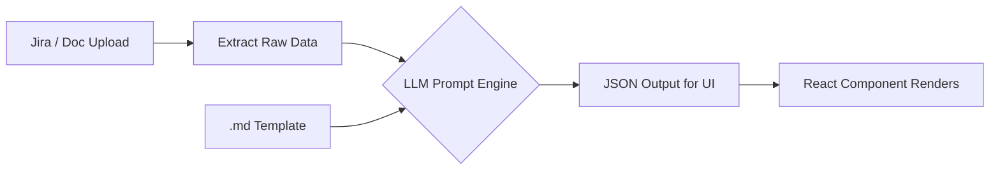

# IntelliPlan AI — Session Progress & Resumption Guide
> **Last Updated:** 2026-04-17 01:12 IST  
> **Conversation ID:** `66cbeffa-c69a-4b35-bc71-962b2f841b46`  
> **Status:** 🟡 In Progress — Stage 2 of 4 complete

---

## 🎯 Objective

Build a fully automated, end-to-end QA lifecycle engine that:
1. **Ingests** requirements from Jira (or uploaded docs)
2. **Feeds** them through an LLM (Groq) alongside strict `.md` templates
3. **Generates** ISTQB-aligned QA artifacts at each stage:
   - **User Stories** → **Test Plan** → **Test Scenarios** → **Test Cases**
4. Each stage's output becomes the next stage's input — a fully autonomous QA pipeline.

---

## 🔐 Credentials (Auto-injected on boot from `ui/.env`)

These are loaded in [App.jsx](file:///c:/Users/Achyutam/OneDrive/Desktop/AI%20learning/IntelliPlan.AI/ui/src/App.jsx) via `import.meta.env.VITE_*` variables:

| Key | Source |
|---|---|
| `llm_provider` | `VITE_LLM_PROVIDER` |
| `llm_model` | `VITE_LLM_MODEL` |
| `llm_groqKey` | `VITE_GROQ_API_KEY` |
| `jira_url` | `VITE_JIRA_URL` |
| `jira_email` | `VITE_JIRA_EMAIL` |
| `jira_token` | `VITE_JIRA_TOKEN` |

> [!IMPORTANT]
> Secrets live in `ui/.env` (gitignored). No need to visit Settings page.

---

## 🏗️ Architecture: Template-Driven LLM Pipeline



### The Prompt Pattern (used consistently across all stages)

```
Role: Act as a [ROLE]. Your job is to [JOB DESCRIPTION].

Input Assets:
  Standard Template: [Raw .md template content injected here]
  Source Data: [Jira data / previous stage output injected here]

Execution Logic:
  - Extract: [What to pull from source data]
  - Map: [How to map extracted data to template slots]
  - Synthesize: [Domain-specific transformations]
  - Validate: [Completeness checks, defaults for missing fields]

UI MAPPING INSTRUCTIONS:
  [Strict JSON schema the UI components expect]
```

---

## 📁 Key Files Modified This Session

### Core Application
| File | What Changed |
|---|---|
| [App.jsx](file:///c:/Users/Achyutam/OneDrive/Desktop/AI%20learning/IntelliPlan.AI/ui/src/App.jsx) | Replaced old handshake `useEffect` with hardcoded credential injection |
| [llmGenerate.js](file:///c:/Users/Achyutam/OneDrive/Desktop/AI%20learning/IntelliPlan.AI/ui/src/lib/llmGenerate.js) | Improved Groq error handling — now parses `error.message` from API response body |

### Stage 1: User Stories
| File | What Changed |
|---|---|
| [UserStories.jsx](file:///c:/Users/Achyutam/OneDrive/Desktop/AI%20learning/IntelliPlan.AI/ui/src/pages/UserStories.jsx) | Imported `user_story_spec.md?raw`, replaced prompt with Extract→Map→Synthesize→Validate pattern |

### Stage 2: Test Plan
| File | What Changed |
|---|---|
| [TestPlan.jsx](file:///c:/Users/Achyutam/OneDrive/Desktop/AI%20learning/IntelliPlan.AI/ui/src/pages/TestPlan.jsx) | Imported `test_plan_spec.md?raw`, upgraded prompt to same execution logic pattern, added robust JSON extraction (`startBrace/endBrace` + trailing comma fix) |

### Templates (Critical Fix)
| File | Size | Notes |
|---|---|---|
| [user_story_spec.md](file:///c:/Users/Achyutam/OneDrive/Desktop/AI%20learning/IntelliPlan.AI/ui/src/templates/user_story_spec.md) | 1.7 KB | Extracted from binary `.docx` |
| [test_plan_spec.md](file:///c:/Users/Achyutam/OneDrive/Desktop/AI%20learning/IntelliPlan.AI/ui/src/templates/test_plan_spec.md) | 5.0 KB | Extracted from updated `.doc` |
| [test_scenario_spec.md](file:///c:/Users/Achyutam/OneDrive/Desktop/AI%20learning/IntelliPlan.AI/ui/src/templates/test_scenario_spec.md) | 5.7 KB | Was already plain text |
| [test_case_spec.md](file:///c:/Users/Achyutam/OneDrive/Desktop/AI%20learning/IntelliPlan.AI/ui/src/templates/test_case_spec.md) | 3.4 KB | Extracted from binary `.doc` |

### Backend Tool
| File | What Changed |
|---|---|
| [run_workflow.py](file:///c:/Users/Achyutam/OneDrive/Desktop/AI%20learning/IntelliPlan.AI/tools/run_workflow.py) | Python script for offline E2E pipeline (Jira→Stories→Plan→Scenarios→Cases). Updated to `openai/gpt-oss-120b` model. |

---

## 🐛 Major Bug Fixed This Session

### 413 Payload Too Large from Groq

**Root Cause:** Template files in `Templates/` folder were binary `.docx` files disguised with `.md` extensions. When Vite imported them with `?raw`, it injected ~292KB of binary gibberish into the LLM prompt.

**Fix:** Created a Python extraction script that:
1. Opens each `.docx/.doc` via `zipfile`
2. Parses `word/document.xml` with `xml.etree.ElementTree`
3. Extracts clean text into proper `.md` files under `ui/src/templates/`
4. Updated all React imports to point to clean versions

> [!TIP]
> If the user updates any template `.doc` files in `Templates/`, re-run the extraction:
> ```bash
> python tools/run_workflow.py  # or the inline extraction script
> ```

---

## ✅ Validated Pipeline Stages

### Stage 1: User Stories ✅ COMPLETE
- **Jira Fetch:** INFRA-1 parsed successfully via proxy
- **LLM Generation:** 6 stories generated (US-001 to US-006)
- **Quality:** 85/100 average AI score
- **Template:** `user_story_spec.md` injected into prompt
- **State Persistence:** Stories saved to `sessionStorage` key `us_stories`

### Stage 2: Test Plan ✅ COMPLETE
- **Input:** 6 selected user stories from Stage 1
- **LLM Generation:** Full ISTQB Test Plan generated
- **Output:** Objective, In/Out Scope, Test Types (Smoke/Functional/Regression), Risks
- **Metrics:** 92% Coverage, 16 Est. Days, 0 High Risks
- **Template:** `test_plan_spec.md` injected into prompt
- **State Persistence:** Plan data saved to `sessionStorage` key `tp_data`

### Stage 3: Test Scenarios ❌ NOT YET WIRED
- **Current State:** `TestScenarios.jsx` renders a static hardcoded table (4 dummy scenarios)
- **No `handleGenerate`** function exists — it's purely a UI mockup
- **Template Ready:** `test_scenario_spec.md` (5.7KB) is extracted and available
- **Next Step:** Build full `handleGenerate` with template injection + JSON parsing

### Stage 4: Test Cases ❌ NOT YET WIRED
- **Current State:** `TestCases.jsx` renders 3 hardcoded test cases
- **No `handleGenerate`** function exists
- **Template Ready:** `test_case_spec.md` (3.4KB) is extracted and available
- **Next Step:** Build full `handleGenerate` with template injection + JSON parsing

---

## 🔜 Exact Next Steps (Resume Here)

### 1. Wire Up Test Scenarios (`TestScenarios.jsx`)
```
Action Items:
- Add: import TestScenarioTemplateRaw from '../templates/test_scenario_spec.md?raw';
- Add: import { generateContentWithLLM } from '../lib/llmGenerate';
- Add: useState hooks for scenarios[], generating, generated
- Add: Load storyPool + testPlanData from sessionStorage
- Build: handleGenerate() with Extract→Map→Synthesize→Validate prompt
- Define: JSON output schema for scenarios array
- Add: sessionStorage persistence for generated scenarios
- Add: "Proceed to Test Cases" navigation button
```

**Expected JSON output schema for Test Scenarios:**
```json
[
  {
    "id": "TS-001",
    "name": "Scenario name",
    "description": "Full description",
    "priority": "High/Medium/Low",
    "type": "Functional/Security/Integration",
    "linkedStory": "US-001",
    "preconditions": "What must be true before",
    "status": "Draft"
  }
]
```

### 2. Wire Up Test Cases (`TestCases.jsx`)
```
Action Items:
- Add: import TestCaseTemplateRaw from '../templates/test_case_spec.md?raw';
- Add: import { generateContentWithLLM } from '../lib/llmGenerate';
- Add: useState hooks for cases[], generating, generated
- Add: Load scenarios from sessionStorage
- Build: handleGenerate() with template-driven prompt
- Define: JSON output schema for test cases array
- Add: "Generate Automation Code" navigation to /code-gen
```

**Expected JSON output schema for Test Cases:**
```json
[
  {
    "id": "TC-001",
    "title": "Test case title",
    "linkedScenario": "TS-001",
    "steps": ["Step 1", "Step 2", "Step 3"],
    "expected": "Expected result description",
    "priority": "HIGH/MEDIUM/LOW",
    "labels": ["Security", "Auth"],
    "preconditions": "Prerequisites"
  }
]
```

### 3. Validate Full E2E with Playwright
```
Flow: Landing → User Stories (Jira INFRA-1) → Test Plan → Test Scenarios → Test Cases
Record the entire pipeline as a demo video.
```

---

## 📂 Project Structure Reference

```
IntelliPlan.AI/
├── Templates/                        # Original .doc/.docx templates (binary)
│   ├── Use Story/User Story.md       # Actually a .docx
│   ├── TestPlan_Template/Test Plan - Template.doc
│   ├── test Scenario template/New Text Document.md  # Plain text
│   └── Test Case Template/Test Case.doc
├── tools/
│   └── run_workflow.py               # Offline Python E2E pipeline
├── ui/
│   ├── src/
│   │   ├── App.jsx                   # Root — credentials auto-injected here
│   │   ├── lib/
│   │   │   └── llmGenerate.js        # LLM API caller (Groq/Ollama/OpenAI/Grok)
│   │   ├── templates/                # Clean extracted text templates
│   │   │   ├── user_story_spec.md    # 1.7 KB
│   │   │   ├── test_plan_spec.md     # 5.0 KB
│   │   │   ├── test_scenario_spec.md # 5.7 KB
│   │   │   └── test_case_spec.md     # 3.4 KB
│   │   └── pages/
│   │       ├── UserStories.jsx       # ✅ WIRED — Template + Execution Logic
│   │       ├── TestPlan.jsx          # ✅ WIRED — Template + Execution Logic
│   │       ├── TestScenarios.jsx     # ❌ STATIC MOCKUP — Needs wiring
│   │       └── TestCases.jsx         # ❌ STATIC MOCKUP — Needs wiring
│   └── .env                          # Jira env vars (legacy, now in App.jsx)
└── .tmp/INFRA-5/                     # Offline generated artifacts
    ├── 1_User_Stories.md
    ├── 2_Test_Plan.md
    ├── 3_Test_Scenarios.md
    └── 4_Test_Cases.md
```

---

## 🚀 How to Start the Project
```bash
cd "c:\Users\Achyutam\OneDrive\Desktop\AI learning\IntelliPlan.AI"
npm --prefix ui run dev
# App runs at http://localhost:5173
# Credentials auto-injected — no Settings needed
# Navigate to /user-stories to start the pipeline
```
